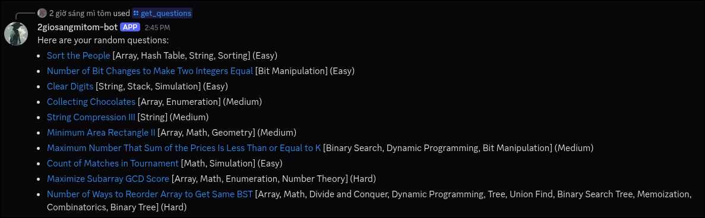

# 2giosangmitom-bot

This is a discord bot to get random questions from LeetCode. It can filter by difficutlty, topics.

## Build

### Prerequisites

- Nix
- A discord App

### Steps

1. Clone the project

   ```bash
   git clone https://github.com/2giosangmitom/2giosangmitom-bot.git
   ```

2. Create a `token.txt` file at the root directory of the project, and paste your bot's token to this file
3. Enter dev environment

   ```bash
   nix develop
   ```

4. Build

   ```bash
   make
   ```

5. Run the executable

   ```bash
   ./build/2giosangmitom-bot
   ```

## Preview


