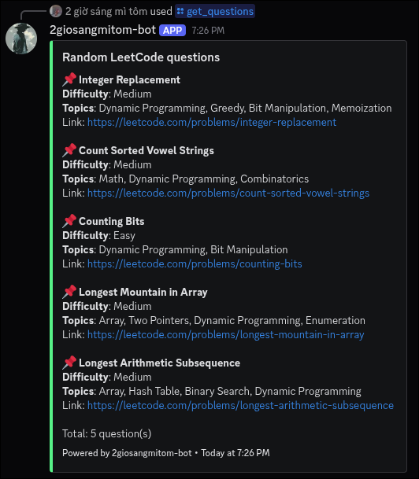
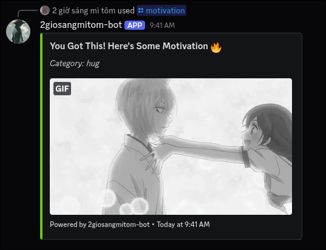

# 2giosangmitom-bot

A simple Discord bot that fetches random **LeetCode** questions. Supports filtering by **difficulty** and **topics**.

## 🚀 Features

- Fetch random LeetCode problems.
- Filter questions by difficulty (Easy, Medium, Hard).
- Filter by specific problem topics.

## 🛠️ Build instructions

### ✅ Prerequisites:

- [Nix](https://nixos.org/) (for reproducible development environment)
- A Discord bot token (create an app at [Discord Developer Portal](https://discord.com/developers/applications))

### ✅ Steps:

1. Clone the repository:

   ```bash
   git clone https://github.com/2giosangmitom/2giosangmitom-bot.git
   cd 2giosangmitom-bot
   ```

2. Add your Discord bot token:

   ```bash
   echo "YOUR_BOT_TOKEN_HERE" > token.txt
   ```

3. Enter the development environment:

   ```bash
   nix develop
   ```

4. Build the project:

   ```bash
   make
   ```

5. Run the bot:

   ```bash
   ./build/2giosangmitom-bot
   ```

## 🤡 Special features

- Get random anime girl image for motivation :)
- ...update later :)

## 🖼️ Preview





## ➕ Invite the bot to your server

Use this link to invite the bot to your Discord server:

> [Invite Link](https://discord.com/oauth2/authorize?client_id=1390858240539099146&permissions=18432&integration_type=0&scope=bot)

## 🙏 Thanks

This project wouldn't be possible without the following open-source projects:

- [DPP](https://github.com/brainboxdotcc/DPP) - A powerful, modern C++ Discord API library.
- [nlohmann/json](https://github.com/nlohmann/json) - A popular and easy-to-use C++ JSON library.
